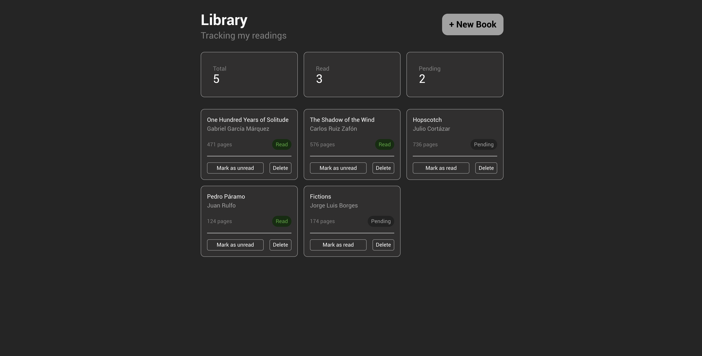

# Library

This project belongs to the [JavaScript](https://www.theodinproject.com/paths/full-stack-javascript/courses/javascript) course from [The Odin Project](https://www.theodinproject.com/).

Books are stored as objects in an array. The page display is generated from that data rather than manipulated directly. The objective is keeping data and presentation as separate concerns.

## Features

- Book constructor: creates book objects with a title, author, page count, read status, and a unique id generated via `crypto.randomUUID()`.
- Add books: an `addBookToLibrary()` function takes the book details, builds a Book from a constructor and pushes it into the library array.
- Render the library: a `renderAll()` function loops through the array and renders each book on the page.
- New Book form: a button opens a form for entering title, author, pages, and read status.
- Remove books: each book has a delete button. 
- Toggle read status: each book has a button wired to a Book prototype method that flips its read value.
- Metrics summary: there are metrics to show `total`, `read` and `pending` books.

## Notes

No persistent storage. The library resets on page reload.

## Updates
- [2026-07-18]: change Book from plain constructor to class -> [678e738](https://github.com/circobit/library/commit/678e7384b57e5f3bd8f47ae2d34d798d0d8298ae). TOP chapter: [classes](https://www.theodinproject.com/lessons/node-path-javascript-classes).

## Live demo

[Try It Here](https://circobit.github.io/library/)

## Screenshots

